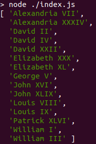

## [RoyalRumble](https://github.com/ariefsn/royalrumble.git)

### What is it?

  ```
  An ordinal number is a word representing rank or sequential order.
  The naming convention for royal names is to follow a given name with an ordinal number using a Roman numeral to indicate the birth order of two people of the same name.
  The Roman numerals from 1 to 50 are defined as follows: The numbers 1 through 10 are written I, II, III, IV, V, VI, VII, VIII, IX, and X. The Roman numerals corresponding to the numbers 20, 30, 40, and 50 are XX, XXX, XL, and L. For any other two-digit number < 50, its Roman numeral representation is constructed by concatenating the numeral(s) for its multiples of ten with the numeral(s) for its values < 10. For example, 47 is 40 + 7 = "XL" + "VII" = "XLVII".
  In this challenge, you will be given a list of royal name strings consisting of a given name followed by an ordinal number. You must sort the list first alphabetically by name, then by ordinal increasing within any given name.
  For example, if you are given the royal names [George VI, William II, Elizabeth I, William I] the result of the sort is [Elizabeth I, George VI, William I, William II].
  ```

### How to use

#### 1. Initiate

  ```javascript
  const royalrumble = require('./royalrumble')
  ```

#### 2. Set Input

  ```javascript
  const names = [
    'Louis IX',
    'Louis VIII',
    'David II',
    'William I',
    'George V',
    'John XLIX',
    'William III',
    'Elizabeth XL',
    'Patrick XLVI',
    'Elizabeth XXX',
    'David XXII',
    'David IV',
    'Alexandria XXXIV',
    'John XVI',
    'Alexandria VII'
  ]
  ```

#### 3. Get Result

  ```javascript
  const result = royalrumble.getSortedNames(names)
  console.log(result)
  ```
  
#### 4. Run It

  ```javascript
  // Run it with node
  // node ./index.js
  // Result will be like
  [
    'Alexandria VII',
    'Alexandria XXXIV',
    'David II',
    'David IV',
    'David XXII',
    'Elizabeth XXX',
    'Elizabeth XL',
    'George V',
    'John XVI',
    'John XLIX',
    'Louis VIII',
    'Louis IX',
    'Patrick XLVI',
    'William I',
    'William III'
  ]
  ```

  
